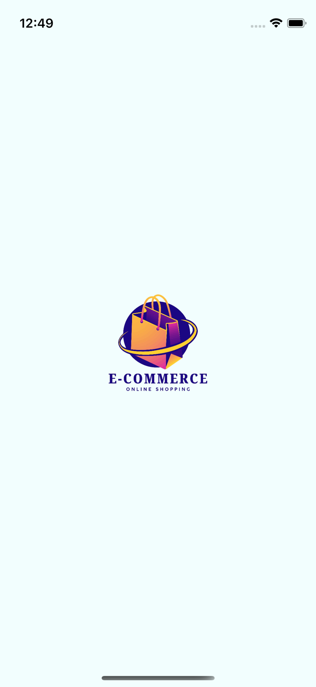

# ecommerce_app

This is a simple e-commerce app implemented using clean-architecture + provider
with functionality of authentication, listing products, add to favorite 
and getting profile data provided with device info in iPhone like iOS & name using channels

"To get starting":

1=> please run the project

2=> ensure that you have implemented flutter pub get

3=> login or signup to start using the app features that we've talked about.

App Screenshots:

<h3>App Screenshots:</h3>

  
  
  

  
  
  

  
  

"Challenges That I've Faced":
is implementing clean architecture way for every single step in the app to ensure the clean code way is implemented well,
also writing function in appDelegate to get the iOS device number (system version) and the model of the iPhone, then showing them inside profile screen.

## Getting Started

This project is a starting point for a Flutter application.

A few resources to get you started if this is your first Flutter project:

- [Lab: Write your first Flutter app](https://docs.flutter.dev/get-started/codelab)
- [Cookbook: Useful Flutter samples](https://docs.flutter.dev/cookbook)

For help getting started with Flutter development, view the
[online documentation](https://docs.flutter.dev/), which offers tutorials,
samples, guidance on mobile development, and a full API reference.
